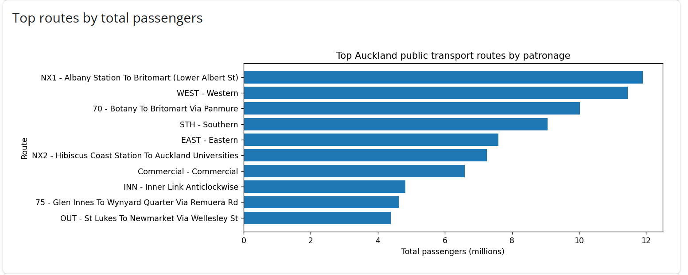
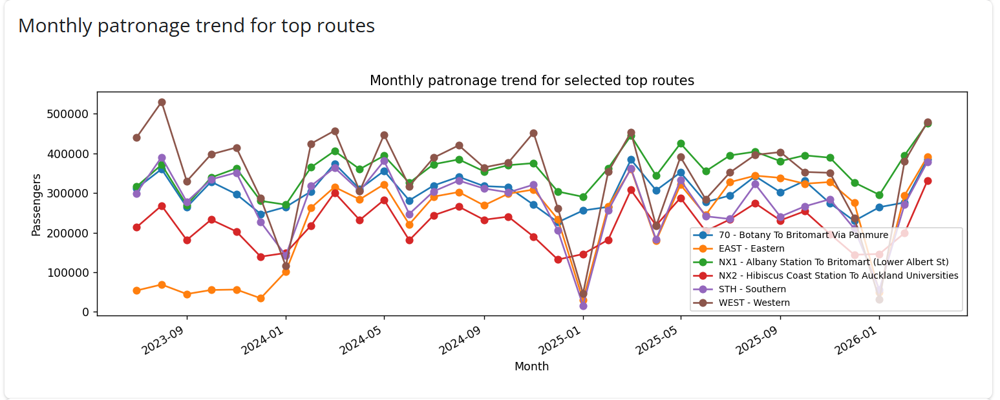
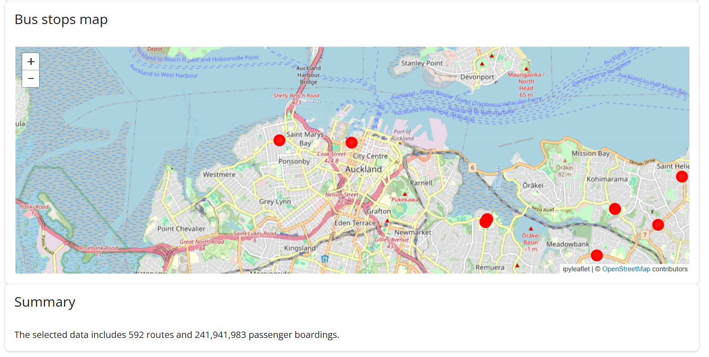

# Motivation and Audience
This dashboard explores Auckland public transport patronage patterns across major bus, train, and ferry routes between 2023 and 2026. Auckland generates large amounts of transport data each month, but the raw spreadsheets are difficult to interpret quickly or compare across routes and time periods. The dashboard addresses this problem by transforming complex patronage datasets into an interactive and easy to understand visual application.

The dashboard is designed for Auckland Transport planners, urban researchers, students, and members of the public interested in understanding how public transport usage changes over time. It allows users to filter the data by transport mode, year range, and number of top performing routes, making it easier to explore trends interactively.

The application enables users to identify which transport routes carry the highest passenger volumes, how patronage changes month by month, and how transport infrastructure is distributed spatially across Auckland. These insights can support transport planning, service evaluation, and discussions about future investment in Auckland’s public transport network.

# Data and Preparation
The dashboard uses publicly available Auckland Transport datasets. The primary dataset was the Auckland Transport monthly bus, train, and ferry patronage by route spreadsheets covering the period from 2023 to 2026. These datasets included variables such as transport mode, route type, route number, route name, service level classification, geographic area, and monthly passenger boardings. An additional Auckland Transport spatial dataset containing bus stop coordinates was used to create the interactive map component of the dashboard.

The patronage data initially contained multiple formatting issues because the spreadsheets were designed for reporting rather than direct analysis. The data preparation process involved combining several yearly Excel files into a single dataset, removing unnecessary metadata rows, renaming columns, and converting the monthly passenger columns into a long format using pandas. Date columns were converted into proper datetime values, and passenger counts were converted into numeric variables. Missing or invalid values were removed during cleaning to ensure the dashboard calculations worked correctly. The final cleaned dataset was exported as a CSV file to improve loading performance within the Shiny application.

The spatial bus stop dataset also required preparation. The downloaded coordinates were nested inside geometry fields, so longitude and latitude values were extracted and converted into separate numeric columns before being saved as a simplified CSV file. This reduced the dataset size and improved rendering speed in the interactive map.

One limitation of the project is that the dashboard focuses mainly on patronage totals and does not include demographic or socioeconomic variables that may influence public transport usage. The spatial map also displays bus stop locations only and does not visualise complete route geometries or service frequencies. Additionally, some routes had incomplete monthly data, which may affect comparisons across time.

Spatial reference systems were also considered during preparation. Interactive leaflet maps require coordinates in the WGS84 geographic coordinate system (EPSG:4326). The bus stop coordinates were therefore stored as longitude and latitude values compatible with web mapping. This ensured that the ipyleaflet map displayed correctly within the browser-based Shiny application.

# Technical Architecture
The application is built as a Shiny for Python dashboard in app.py. The structure follows a sidebar layout, with user controls on the left and visual outputs in the main panel. The app loads cleaned CSV files at startup, including the route level patronage dataset and the bus stop spatial dataset. The user interface contains three main inputs: transport mode, year range, and number of top routes.

The main reactive dependency is handled by the filtered_data() function, which is defined using @reactive.calc. This function filters the patronage dataset based on the selected transport mode and year range. The filtered result is then shared across multiple outputs, including the top routes bar chart, monthly trend chart, and summary text. This avoids repeating the same filtering code separately for each output and reduces redundant computation.

The visual outputs use different render decorators depending on output type. The bar chart and line chart use @render.plot with matplotlib. The summary uses @render.text, and the interactive map uses @render_widget with ipyleaflet. The map displays bus stop locations using longitude and latitude coordinates from the cleaned spatial dataset.

The main performance consideration was keeping the dashboard lightweight enough to run in the browser through ShinyLive. The original Excel files were cleaned into smaller CSV files before being used in the app. The patronage data was reshaped into long format during preprocessing, so the app does not need to repeat expensive cleaning steps at runtime. The trend chart is also limited to a smaller number of top routes to avoid visual clutter and reduce rendering load. The bus stop map uses simplified coordinate data rather than large raw spatial files, which helps the deployed app load faster.

# User Interface Walkthrough
The dashboard is designed to provide a simple and interactive workflow for exploring Auckland public transport patronage data. Users begin by selecting filters from the sidebar on the left side of the application. These filters include transport mode, year range, and the number of top performing routes displayed. The dashboard updates automatically whenever a filter is changed, allowing users to explore different combinations of data in real time.

The first visualisation is a horizontal bar chart showing the routes with the highest total passenger volumes within the selected filters. This allows users to quickly identify which Auckland public transport routes are the busiest. The chart dynamically changes based on the selected transport mode and year range.

{width=85%}

The second visualisation is a monthly trend chart that displays how patronage changes over time for the selected top routes. Users can compare seasonal variation, long term growth, and differences between routes. Restricting the chart to a smaller number of top routes helps improve readability and reduces clutter.

{width=85%}

The dashboard also includes an interactive ipyleaflet map showing the spatial distribution of Auckland bus stop locations. Users can zoom and pan around the map to explore transport infrastructure spatially. This adds geographic context to the statistical charts and helps users identify areas with higher transport service density.

{width=85%}

The workflow of the application moves from filtering data, to identifying high demand routes, to exploring temporal trends and spatial patterns. This structure allows users to move from raw information toward meaningful transport insights in a clear and interactive way.

# Limitations and Future Improvements
One limitation of the dashboard is that the patronage data is aggregated at the route level and does not include detailed passenger origin and destination information. This limits the ability to analyse specific travel patterns or commuter flows across Auckland. In addition, the spatial component currently visualises bus stop locations only and does not display full transport route geometries or service frequencies. As a result, the map provides general spatial context rather than a complete network analysis.

The dashboard also relies on static CSV files generated during preprocessing rather than live API connections. This improves performance and simplifies deployment through ShinyLive, but it means the application does not automatically update when new Auckland Transport data becomes available. Some routes also contained incomplete or inconsistent monthly records, which may slightly affect comparisons between years or transport modes.

Performance considerations also influenced design decisions. To keep the dashboard responsive in the browser, the number of displayed routes was limited and the bus stop map uses a sampled subset of points instead of the full dataset. While this improves usability, it reduces the level of spatial detail shown on the map.

Several future improvements could extend the functionality of the application. One improvement would be integrating Auckland Transport service route geometries so that patronage could be mapped directly onto transport routes rather than only showing stop locations. Additional datasets such as census commuting data, traffic congestion data, or crash data could also provide broader transport context. The dashboard could also be expanded with live API integration, hover tooltips, route specific filtering, or predictive analytics to forecast future patronage trends. These additions would create a more advanced transport planning and spatial analysis tool.
